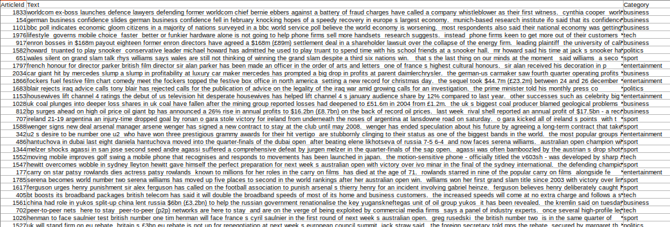
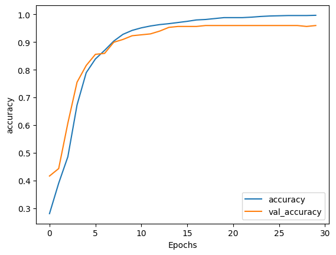
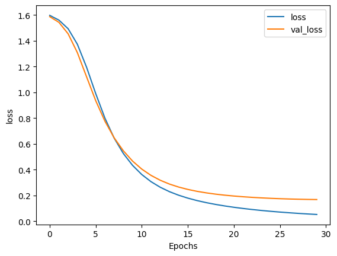

# Text-classifier-using-Embedding-Layer
## AIM
To create a classifier using specialized layers for text data such as Embedding and GlobalAveragePooling1D.

## PROBLEM STATEMENT AND DATASET

The problem is to build a text classification model to categorize BBC news articles into predefined categories. The model will process raw text data, remove stopwords and punctuation, vectorize the text, and encode the labels. The goal is to train a neural network using TensorFlow to predict the correct category for each article based on its content.


## DESIGN STEPS
**STEP 1: Data Preprocessing**
- Load the dataset from the zip file and split it into text (news articles) and labels (categories).
- Standardize the text by removing stopwords, converting text to lowercase, and eliminating punctuation.

**STEP 2: Text Vectorization**
- Use a `TextVectorization` layer to convert the cleaned text into sequences of integers, representing the words in the text.
- Limit the vocabulary size and pad/truncate sentences to a fixed length.

**STEP 3: Label Encoding**
- Encode the text labels (categories) into numeric values using a `StringLookup` layer, ensuring compatibility with the neural network.

**STEP 4: Dataset Splitting**
- Split the dataset into training and validation sets to evaluate the model performance during training.

**STEP 5: Model Creation and Training**
- Define a neural network model with an embedding layer, followed by pooling, dense layers, and a softmax output layer.
- Train the model using the preprocessed data and evaluate its performance on the validation set.


## PROGRAM
### Name:            Sam Israel D
### Register Number: 212222230128

##### Loading & Preprocessing Data
```python
import tensorflow as tf
import numpy as np
import matplotlib.pyplot as plt
import zipfile

# To unzip and read the CSV file inside the zip file
with zipfile.ZipFile('./BBC News Train.csv.zip', 'r') as zip_ref:
    zip_ref.extractall('extracted_data')

with open("extracted_data/BBC News Train.csv", 'r') as csvfile:
    print(f"First line (header) looks like this:\n\n{csvfile.readline()}")
    print(f"The second line (first data point) looks like this:\n\n{csvfile.readline()}")

# Define the global variables
VOCAB_SIZE = 1000
EMBEDDING_DIM = 16
MAX_LENGTH = 120
TRAINING_SPLIT = 0.8

data_dir = "./extracted_data/BBC News Train.csv"
data = np.loadtxt(data_dir, delimiter=',', skiprows=1, dtype='str', comments=None)
print(f"Shape of the data: {data.shape}")
print(f"{data[0]}\n{data[1]}")

# Test the function
print(f"There are {len(data)} sentence-label pairs in the dataset.\n")
print(f"First sentence has {len((data[0,1]).split())} words.\n")
print(f"The first 5 labels are {data[:5,2]}")
```
##### Train-Validation Split
```python
# train_val_datasets
def train_val_datasets(data):

    train_size = int(0.8 * len(data))

    # Slice the dataset to get only the texts. Remember that texts are on the second column
    texts = data[:,1]
    # Slice the dataset to get only the labels. Remember that labels are on the first column
    labels = data[:,2]
    # Split the sentences and labels into train/validation splits.
    train_texts = texts[:train_size]
    validation_texts = texts[train_size:]
    train_labels = labels[:train_size]
    validation_labels = labels[train_size:]
    
    # Create the train and validation datasets from the splits
    train_dataset = tf.data.Dataset.from_tensor_slices((train_texts, train_labels))
    validation_dataset = tf.data.Dataset.from_tensor_slices((validation_texts, validation_labels))
    
    return train_dataset, validation_dataset

# Create the datasets
train_dataset, validation_dataset = train_val_datasets(data)
print(f"There are {train_dataset.cardinality()} sentence-label pairs for training.\n")
print(f"There are {validation_dataset.cardinality()} sentence-label pairs for validation.\n")
```
##### Text Standardization (Stopword Removal & Lowercasing)
```python
def standardize_func(sentence):

    stopwords = ["a", "about", "above", "after", "again", "against", "all", "am", "an", "and", "any", "are", "as", "at", "be", "because", "been", "before", "being", "below", "between", "both", "but", "by", "could", "did", "do", "does", "doing", "down", "during", "each", "few", "for", "from", "further", "had", "has", "have", "having", "he", "her", "here",  "hers", "herself", "him", "himself", "his", "how",  "i", "if", "in", "into", "is", "it", "its", "itself", "let's", "me", "more", "most", "my", "myself", "nor", "of", "on", "once", "only", "or", "other", "ought", "our", "ours", "ourselves", "out", "over", "own", "same", "she",  "should", "so", "some", "such", "than", "that",  "the", "their", "theirs", "them", "themselves", "then", "there", "these", "they", "this", "those", "through", "to", "too", "under", "until", "up", "very", "was", "we",  "were", "what",  "when", "where", "which", "while", "who", "whom", "why", "why", "with", "would", "you",  "your", "yours", "yourself", "yourselves", "'m",  "'d", "'ll", "'re", "'ve", "'s", "'d"]

    # Sentence converted to lowercase-only
    sentence = tf.strings.lower(sentence)

    # Remove stopwords
    for word in stopwords:
        if word[0] == "'":
            sentence = tf.strings.regex_replace(sentence, rf"{word}\b", "")
        else:
            sentence = tf.strings.regex_replace(sentence, rf"\b{word}\b", "")

    # Remove punctuation
    sentence = tf.strings.regex_replace(sentence, r'[!"#$%&()\*\+,-\./:;<=>?@\[\\\]^_`{|}~\']', "")

    return sentence
```
##### Fit Vectorizer (Text to Sequences)
```python
def fit_vectorizer(train_sentences, standardize_func):

    # Initialize the TextVectorization layer
    vectorizer = tf.keras.layers.TextVectorization( 
		standardize=standardize_func,
		max_tokens=VOCAB_SIZE,
		output_sequence_length=MAX_LENGTH
	) 
    
    # Adapt the vectorizer to the training sentences
    vectorizer.adapt(train_sentences)

    return vectorizer

# Create the vectorizer
text_only_dataset = train_dataset.map(lambda text, label: text)
vectorizer = fit_vectorizer(text_only_dataset, standardize_func)
vocab_size = vectorizer.vocabulary_size()
print(f"Vocabulary contains {vocab_size} words\n")
```
##### Fit Label Encoder (Text Labels to Numeric)
```python
def fit_label_encoder(train_labels, validation_labels):

    # Concatenate the two label datasets
    labels = train_labels.concatenate(validation_labels)
    
    # Instantiate the StringLookup layer. No OOV tokens
    label_encoder = tf.keras.layers.StringLookup(oov_token=None, mask_token=None, num_oov_indices=0)
    
    # Fit the label encoder on the combined label set
    label_encoder.adapt(labels)
    
    return label_encoder

# Create the label encoder
train_labels_only = train_dataset.map(lambda text, label: label)
validation_labels_only = validation_dataset.map(lambda text, label: label)

label_encoder = fit_label_encoder(train_labels_only, validation_labels_only)
print(f'Unique labels: {label_encoder.get_vocabulary()}')
```
##### Preprocess Dataset (Text & Labels)
```python
def preprocess_dataset(dataset, text_vectorizer, label_encoder):

    # Convert the Dataset sentences to sequences, and encode the text labels
    dataset = dataset.map(lambda text, label: (text_vectorizer(text), label_encoder(label)))
    dataset = dataset.batch(32)  # Set a batch size of 32
    
    return dataset

# Preprocess your dataset
train_proc_dataset = preprocess_dataset(train_dataset, vectorizer, label_encoder)
validation_proc_dataset = preprocess_dataset(validation_dataset, vectorizer, label_encoder)

train_batch = next(train_proc_dataset.as_numpy_iterator())
validation_batch = next(validation_proc_dataset.as_numpy_iterator())
print(f"Shape of the train batch: {train_batch[0].shape}")
print(f"Shape of the validation batch: {validation_batch[0].shape}")
```
##### Model Creation
```python
def create_model():

    # Define the model architecture
    model = tf.keras.Sequential([ 
        tf.keras.Input(shape=(MAX_LENGTH,)),  
        tf.keras.layers.Embedding(VOCAB_SIZE, EMBEDDING_DIM),  
        tf.keras.layers.GlobalAveragePooling1D(),  
        tf.keras.layers.Dense(24, activation='relu'), 
        tf.keras.layers.Dense(5, activation='softmax') 
    ])
    
    # Compile the model with the categorical cross-entropy loss, Adam optimizer, and accuracy as the metric
    model.compile(
        loss='sparse_categorical_crossentropy',  # Loss function for multi-class classification
        optimizer='adam',  # Optimizer
        metrics=['accuracy']  # We want to track accuracy during training
    ) 

    return model

# Get the untrained model
model = create_model()

example_batch = train_proc_dataset.take(1)

try:
	model.evaluate(example_batch, verbose=False)
except:
	print("Your model is not compatible with the dataset you defined earlier. Check that the loss function and last layer are compatible with one another.")
else:
	predictions = model.predict(example_batch, verbose=False)
	print(f"predictions have shape: {predictions.shape}")

history = model.fit(train_proc_dataset, epochs=30, validation_data=validation_proc_dataset)
```
##### Plotting
```python
def plot_graphs(history, metric):
    plt.plot(history.history[metric])
    plt.plot(history.history[f'val_{metric}'])
    plt.xlabel("Epochs")
    plt.ylabel(metric)
    plt.legend([metric, f'val_{metric}'])
    plt.show()
print('Name: Sam Israel D       Register Number: 212222230128       ')
plot_graphs(history, "accuracy")
plot_graphs(history, "loss")
```
## OUTPUT
### Loss, Accuracy Vs Iteration Plot
 


## RESULT
Thus, a classifier using specialized layers for text data such as Embedding and GlobalAveragePooling1D is successfully created!